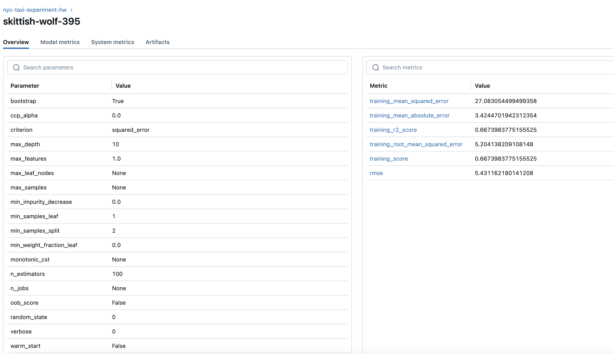

# mlopszoomcamp-2024

For week2 we will learn experiment tracking with mlflow.
Create a new conda environment with python 3.9 and install the [requirements.txt](requirements.txt)
```            
conda activate mlflow-experimenttracking
```

Then run requirements.txt
```
pip install -r requirements.txt
```

Check installed requirements are present using
```
pip list
```

check mlflow using below. It sould show options for version and help.
```
mlflow
```
Run below to get mlflow version

```
mlflow --version
```
I got below mlflow, version 2.13.0

Run mlflow with below command.
```
mlflow ui --backend-store-uri sqlite:///mlflow.db
```

## Homework 

### Q1. Install MLflow
```
mlflow --version
```
I got below mlflow, version 2.13.0

### Q2. Download and preprocess the data
Execute below command
```
python preprocess_data.py --raw_data_path ../data --dest_path ./output
```
Four output files are generated
dv.pkl,test.pkl,train.pkl,val.pkl

### Q3. Train a model with autolog

Modified [train.py](./train.py) script to add mlflow tracking.

Execute script.
``` 
python train.py
```
You should see below comments
2024/05/25 22:23:55 INFO mlflow.tracking.fluent: Experiment with name 'nyc-taxi-experiment-hw' does not exist. Creating a new experiment.


The training parameters in mlflow ui is 

min_samples_split used is 2