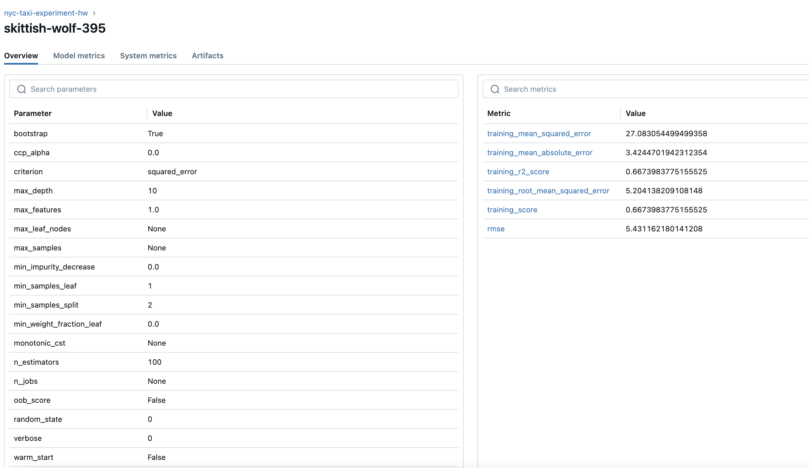
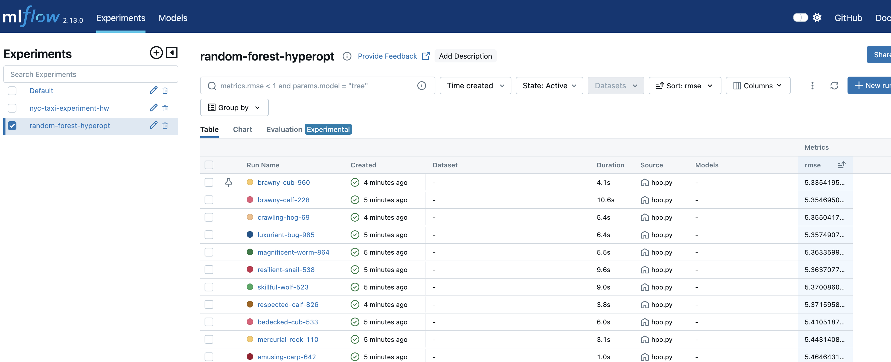
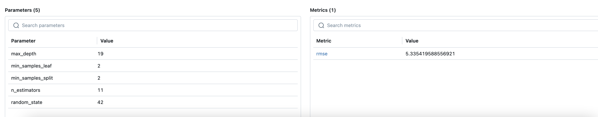

# mlopszoomcamp-2024


## Homework 


### Q1. Install MLflow
```
mlflow --version
```
I got below mlflow, version 2.13.0

### Q2. Download and preprocess the data
Execute below command inside homework folder
```
python preprocess_data.py --raw_data_path ../../data --dest_path ./output
```
Four output files are generated
dv.pkl,test.pkl,train.pkl,val.pkl

### Q3. Train a model with autolog

Modified [train.py](./train.py) script to add mlflow tracking.

Execute script.
``` 
python train.py
```
You should see below comments
2024/05/25 22:23:55 INFO mlflow.tracking.fluent: Experiment with name 'nyc-taxi-experiment-hw' does not exist. Creating a new experiment.


The training parameters in mlflow ui is 

min_samples_split used is 2

### Q4. Launch the tracking server locally

Now we want to manage the entire lifecycle of our ML model. In this step, you'll need to launch a tracking server. This way we will also have access to the model registry.

Your task is to:

launch the tracking server on your local machine,
select a SQLite db for the backend store and a folder called artifacts for the artifacts store.

```
mlflow ui --backend-store-uri sqlite:///mlflow.db --default-artifact-root ./artifacts
```

### Q5. Tune model hyperparameters

Modify the objective function for [hpo.py](./hpo.py) to add below two lines
```
with mlflow.start_run():
mlflow.log_metric("rmse", rmse)
```
Execute the python program as
```
python hpo.py
```
Best rmse can be found in the ui by sorting rmse column
5.335






### Q6. Promote the best model to the model registry

Modify [register_model.py](./register_model.py) to get the best run and print the rmse as below


```
    best_run = client.search_runs(order_by=["metrics.rmse ASC"])[0]
    #Register the best model
    #mlflow.register_model( ... )
    #"runs:/<RUN_ID>/model"
    run_id = best_run.info.run_id       
    result = mlflow.register_model(
       f'runs:/{run_id}/random-forest-best-model', "random-forest-best-model-result"
    )
    print(best_run.data.metrics)
```
Execute script as below
```
python register_model.py
```

Below output is received.

```
{'training_mean_squared_error': 26.08294493276463, 'training_mean_absolute_error': 3.323916924052877, 'training_r2_score': 0.6796805248104354, 'training_root_mean_squared_error': 5.107146456952711, 'training_score': 0.6796805248104354, 'val_rmse': 5.3633599989832135, 'test_rmse': 5.5941605655803635}
```